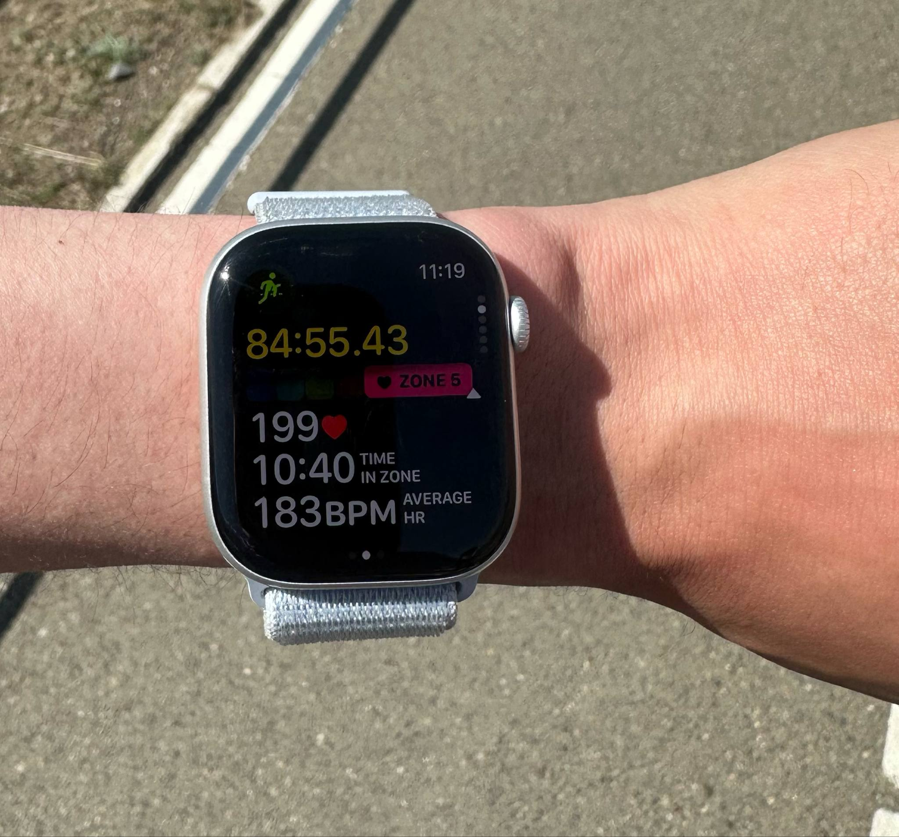
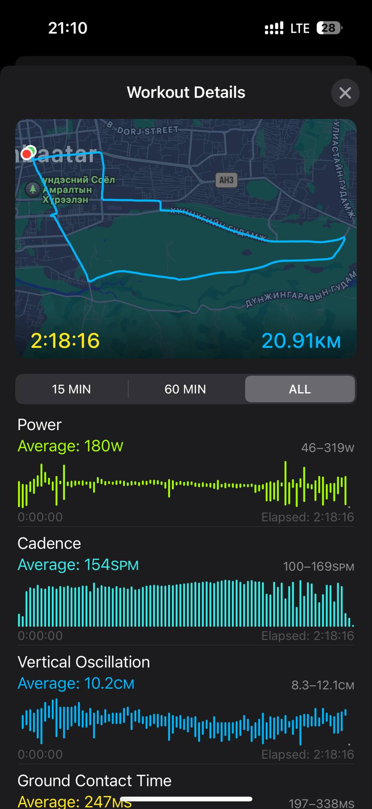

---

So… I just completed a half marathon today. Yup. 21 freakin' kilometers.

Before this, I only ran twice, twice and barely hit 10km before tapping out. But today? I pushed my body way past its comfort zone. Like, two full hours of torture-level cardio. And I wont lie, I hated every single second of it.
But hey, I did it.

At some point during the run (around 85 minutes in), I took this photo because I needed proof of my suffering. My average heart rate was 183 bpm, and it peaked at 199. My watch literally said Zone 5 which basically means you're not training anymore, you are surviving.

**Fun fact: your maximum heart rate is roughly 220 minus your age. So I was right there, giving it my absolute all.**

Now check this out—on the second image, you’ll see the sudden change in cadence graph (full right and left leg movement counted as one step). Things started to fall apart after 1 hour and 40 mins. The power graph’s all over the place, and that’s when my left knee betrayed me like there is no tomorrow. Sharp pain outta nowhere. But guess what? My right leg carried me through that final 30 minutes like a real champ.

And now that it's over, my body feels like it's been hit by a truck, and I’m sitting here thinking:
“Why the hell did I do this to myself?” 😅
But if you’ve ever run a marathon (or half), and you’re feeling miserable like me, I just wanna say:
You did a damn good job.
You pushed yourself. You showed up. And that’s something to be proud of—even if your knees are crying right now.
Alright, that’s all from me. Catch you later, limping around.
<Me/>
